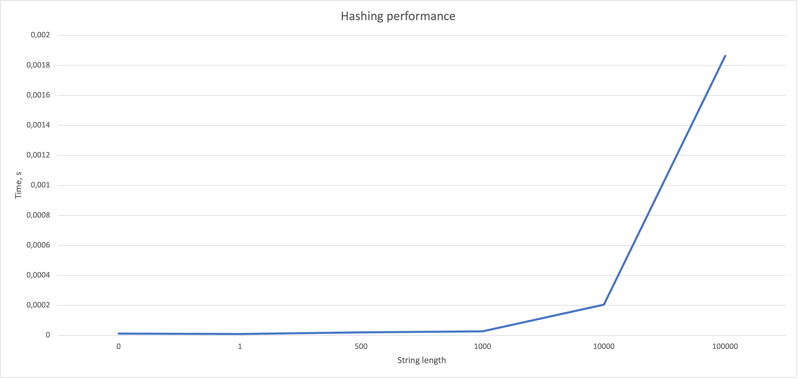

# VU Blockchain hashing algorithm

A custom hashing algorithm implementation for Vilnius University "Blockchain technologies" course.

## Usage

```bash
$ ./Blockchain --i Lietuva
```

## Available commands

| Command          | Description                                                                                                                                |
|------------------|--------------------------------------------------------------------------------------------------------------------------------------------|
| --help           | Shows available commands                                                                                                                   |
| --i {string}     | Hashes provided string                                                                                                                     |
| --if {file_path} | Hashes provided file contents                                                                                                              |
| --g              | Generates test files                                                                                                                       |
| --b {file_path?} | Runs hashing benchmark for constitution.txt file. If path is not provided, then it will look for a file with path "files/constitution.txt" |
| --c              | Runs collision test                                                                                                                        |
| --a              | Runs avalanche test                                                                                                                        |

## Idea

General idea for this hashing algorithm revolves around using `XOR` and `bit rotations`.

```
ABC <- "ABCDEF"

Function makeHash(string str)
    characterSum <- 0
    output <- ''

    For i = 0 To Len(str)
        character <- str[i]
        
        value <- character Xor rotateRight(character, character)
        
        value <- value Xor rotateRight(value, value)
        value <- value Xor rotateRight(value, value)
        
        value <- rotateLeft(value, value)
    Endfor
    
    characterSumArray <- INT_TO_STRING(characterSum)
    
    For i = 0 To 64
        charIndex <- characterSumArray[i] * i
        
        output[i] = ABC[charIndex]
    Endfor
    
    Return output
Endfunction        
```

## Performance



## Strengths and weaknesses

The strengths:
- hashes are generated very quickly (when given string with length <= 1000)
- generated hashes are collision resistant (around 1 collision per 100k unique strings)
- on average two hashes differ<sup>1</sup> from each other by ~83%

The weaknesses:
- algorithm performance suffers when given a large string
- on some rare instances two hashes vary<sup>1</sup> by only ~23%

<sup>1</sup> - difference is measured using Levenshtein distance algorithm, e.g. two strings "aa" and "ab" differ by 50% because one operation is required to make them equal.